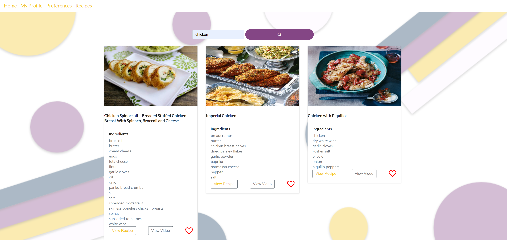
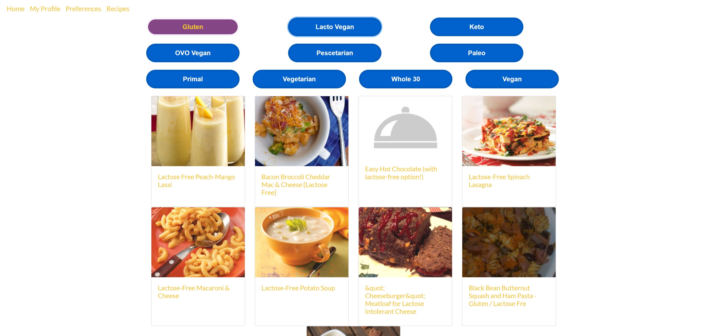

[](http://commonmark.org)

# Project Title: The Sauce Code v2: React
Sauce Code is a web application that allows users to search recipes. This version of the application allows users to create a profile to save their dietary preferences and favorite recipes. Users can also browse the site as a guest.
  
## Installation
  
1. Clone repo
2. Run ```npm install```
3. Run ```cd client && npm install```
4. Run ```npm start```

## Usage

From the home page users can create a profile, sign-in, or search for recipes as a guest


Go to Recipes to search for recipes. This page can be viewed as a guest



Saved recipes can be viewed from My Profile. Only users that are logged in can view this page


User can also discover new recipes according to a dietary prefernce




## Contributing

[@DannieDigital](https://github.com/DannieDigital) - Login/Sign-up front-end

[@domwarit](https://github.com/domwarit) - Meal Preferences front-end

[@clemsontigress](https://github.com/clemsontigress) - Favorites front-end, API Routes

[@ashaheed3](https://github.com/ashaheed3) - Recipes Frontend, Database Models, API Routes, Login/Signup functionality

## Questions
Have a question? Shoot me an email
Email: [ayanna.shaheed@gmail.com](mailto:ayanna.shaheed@gmail.com)
    
